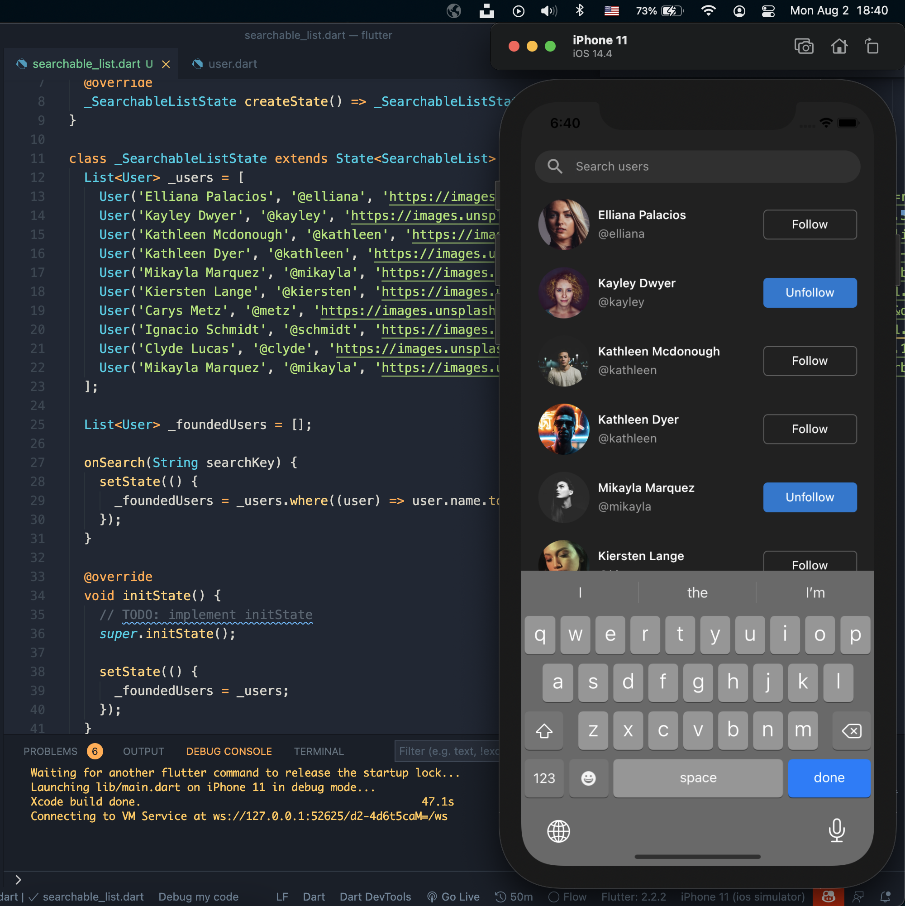
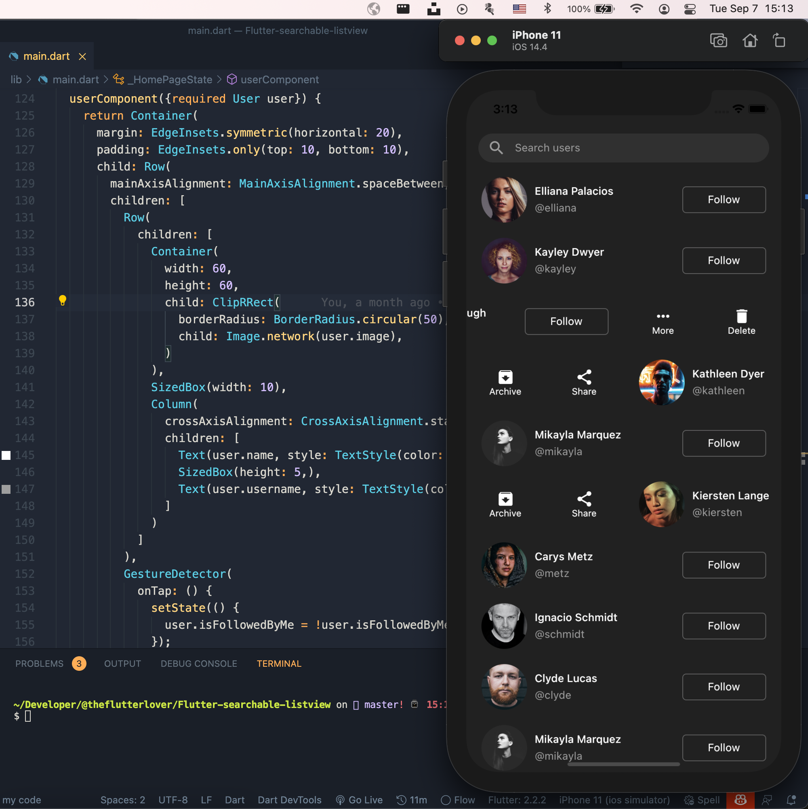

## Flutter Searchable ListView - Day 28

```dart
class Afgprogrammer extends Flutter100DaysOfCode {
  video() {
    return {
      "title": "Flutter Searchable ListView",
      "description": "Let's work with the ListView widget and make it searchable.",
      "day": 28,
      "videoLink": "https://youtu.be/9PWaRfYZ6Lg"
    }
  }
}
```
### [Watch it on Youtube](https://youtu.be/9PWaRfYZ6Lg)

## Previous Designs
[Checkout my Youtube channel](https://youtube.com/afgprogrammer)


## Development Setup
Clone the repository and run the following commands:
```
flutter pub get
flutter run
```

## Screenshot




## Links

* [Website](https://afgprogrammer.com)
* [Youtube channel](https://youtube.com/afgprogrammer)
* [Twitter](https://twitter.com/afgprogrammer)
* [Instagram](https://instagram.com/afgprogrammer)
